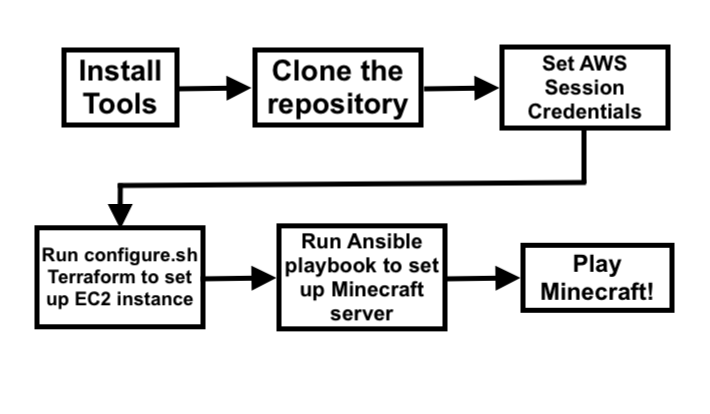
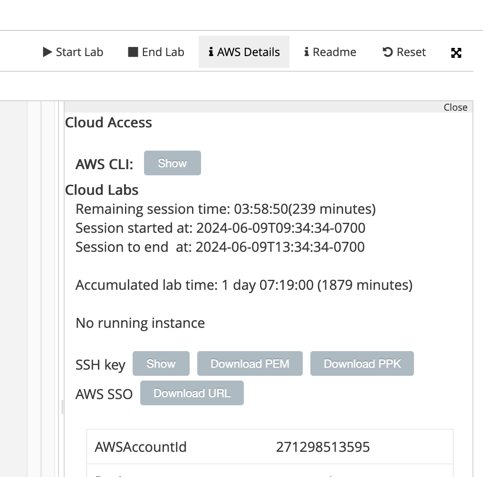

# CS 312 - Course Project Final - Minecraft Server Tutorial

## Background 
This tutorial will walk you through an automated process to set up a Minecraft server using a Docker image.  After setting up your credentials and environment, you only need to run a few scripts, and your Minecraft server will be up and running.  

--- 

## Requirements
- You need an AWS account.  After starting the lab, you will need to grab access key credentials and put them in your ~/.aws/credentials file.  This process will be explained in the Steps section.

- You will want to install the AWS Command Line Interface by following the steps for your system on this [page](https://docs.aws.amazon.com/cli/latest/userguide/getting-started-install.html).

- You should also install `terraform` so that you can run the terraform script which will set up your EC2 instance.  You can follow the steps for your system [here](https://developer.hashicorp.com/terraform/tutorials/aws-get-started/install-cli).

--- 

## Diagram



--- 

## Steps and Explanation

First clone the repository in your terminal by typing the following line in the terminal.  It will clone the scripts and code necessary in a folder called `minecraft-server`:
```
git clone https://github.com/loior/minecraft-server.git
```

You should change directory into this folder by typing: 
```
cd minecraft-server
```


Then, you should grab the AWS session credentials.  To do this, click on AWS Details on the Lab Launch page. 

After that, next to "AWS CLI", click the "Show" button.  Follow the instructions to copy and paste all the text into your ~/.aws/credentials file.  

You should also export these session credentials **in the terminal** by typing the following and replacing the values in brackets with the values that the lab shows you:

``` 
export aws_access_key_id=<REPLACE with key id>
export aws_secret_access_key=<REPLACE with access key>
export aws_session_token=<REPLACE with session token>
```

There should be a script called `configure.sh` in the directory you are in. You will run it next, which will initialize and apply the terraform configuration that sets up the AWS EC2 instance.  You can make sure the script is executable first by typing:
```
chmod +x configure.sh
```
Then, run the script by typing: 
```
./configure.sh
```

-  `configure.sh`  has four lines in it to intialize, format, validate, and apply the terraform script.  At some point, you may have to type `yes` to confirm the configuration. Go ahead and type `yes` whenever it asks you.  The script may take a minute or two to run.  
        
- The terraform script that runs is in `main.tf`.  
    - It configures a security group for the EC2 instance, which includes some inbound rules to allow SSH from any IP and to allow traffic from any IP on port 25565, which is the default port that Minecraft uses.  
    - The terraform script also creates a key pair for the instance.
    - It then makes the instance, specifying the AMI ID, which is the ID for an Ubuntu "Server 24.04 LTS (HVM), SSD Volume Type" image, with a "t2.small" instance type, the security group made earlier, and the key pair made earlier. 

- There is also a file called `outputs.tf` which specifies two things that should be output when the `main.tf` finishes running.  One is the public IP address of the EC2 instance that is created, and the other is the instance ID.  

- So, after the `configure.sh` script finishes running, you should see it print out the public IP address of the EC2 instance you've just created.  Copy that IP address. 
    - Note that if it doesn't print out the IP address, you can run the following command to instruct it to print out the variables in the `outputs.tf` file:
        ```
        terraform output
        ``` 

Open up the `hosts.ini` file.  Replace the bracket placeholder in the beginning of line 2 with the IP address you just copied from the output of the configure script.  

Back in the terminal, you will now run the Ansible playbook to set up the Minecraft server using the Docker image from itzg/minecraft-server, by typing: 
``` 
ansible-playbook playbook.yml -i hosts.ini
```

- This runs the Ansible playbook that sets up the Minecraft server.
- The playbook first downloads Docker.  
- It then runs the Minecraft server container, which is from the Docker image on this [page](https://hub.docker.com/r/itzg/minecraft-server).  
- It configures the server to restart if resources reboot, and makes sure that it gracefully shuts down as well.  
- The `-i hosts.ini` part of the command tells the playbook to grab information from the inventory `hosts.ini` file, which includes the public IP address of the instance, the ansible_user, and the ansible_ssh_private_key_file.

At one point, you may need to type `yes` to confirm that you want to continue connecting.  Go ahead and type `yes` if prompted.  This script may take a couple of minutes to run. 

After the script finishes, your Minecraft server should be set up and ready to play! 

--- 

## How to connect to the Minecraft server once it's running
You can test that the connection to the Minecraft server works by typing the following command in the terminal, using the same public IP address that you copied and pasted into the `hosts.ini` file: 
``` 
nmap -sV -Pn -p T:25565 <public IP address>
```

If you have Minecraft, you can launch it on your computer.  Add a server, and include the public IP address of your instance and the port 25565 for the Server Address.  

Now, you can play Minecraft! 

--- 

## Sources used to make this tutorial 
- https://developer.hashicorp.com/terraform/tutorials/aws-get-started/install-cli
- https://developer.hashicorp.com/terraform/tutorials/aws-get-started/aws-build 
- https://hub.docker.com/r/itzg/minecraft-server
- ChatGPT
